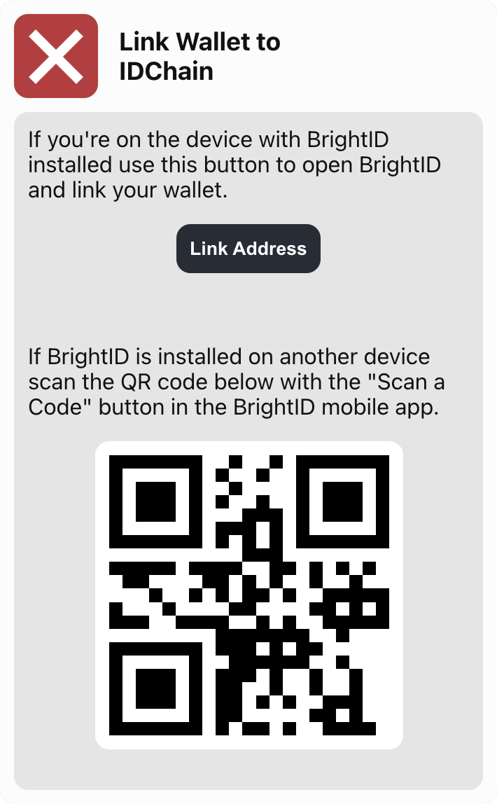
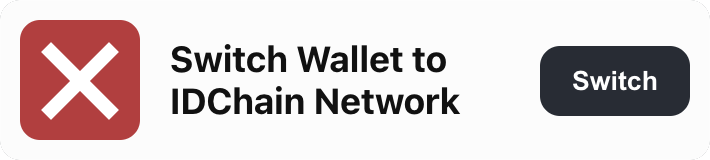
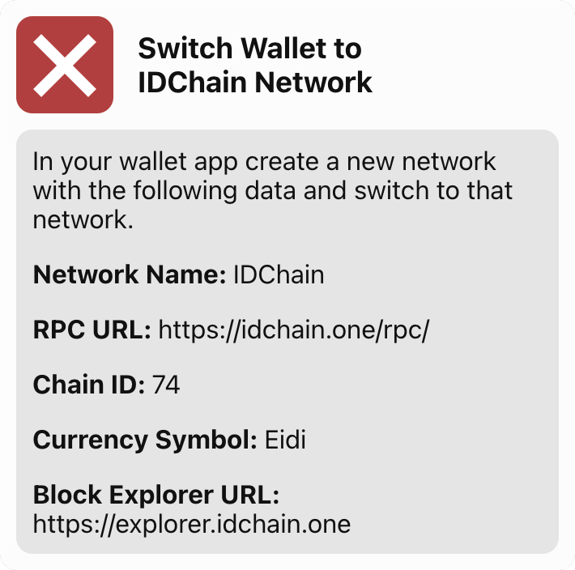
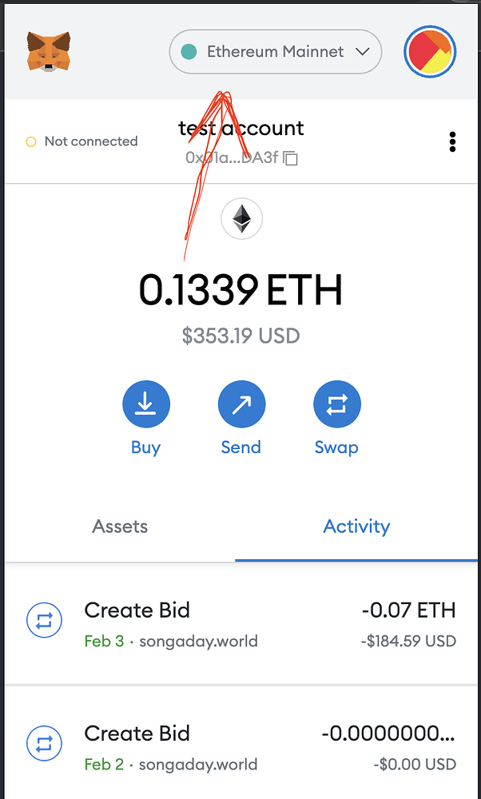
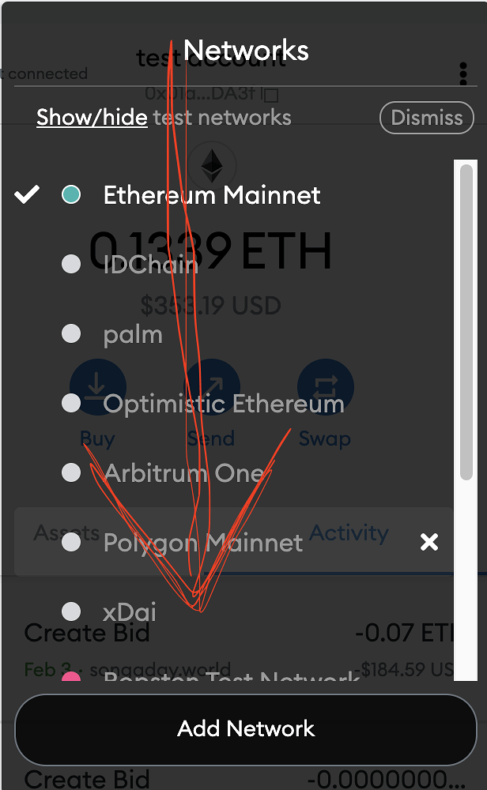
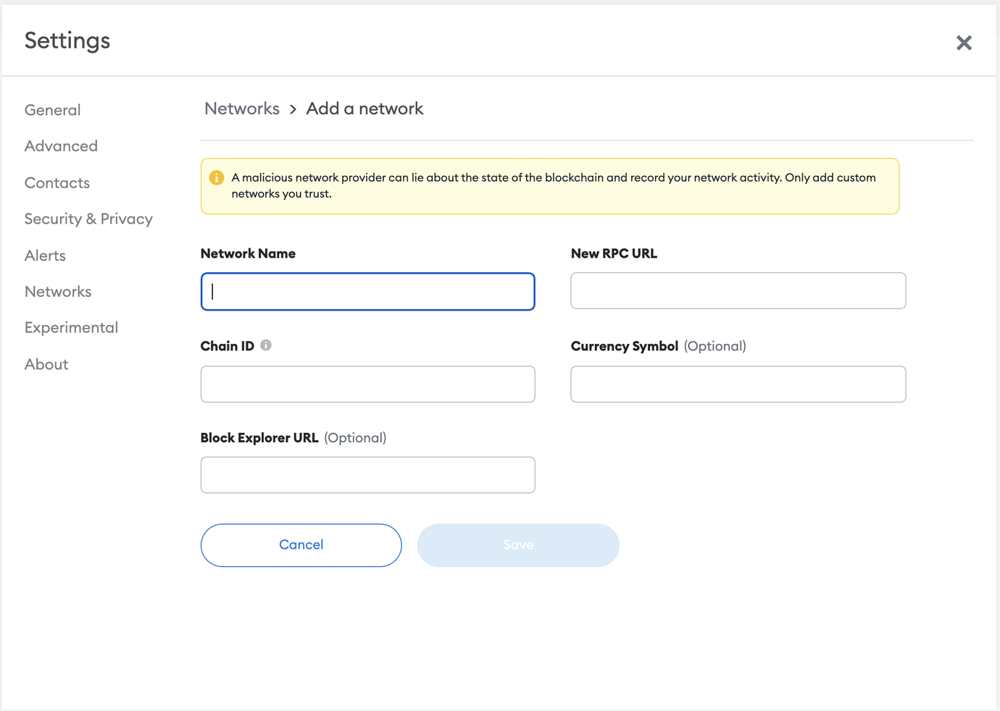
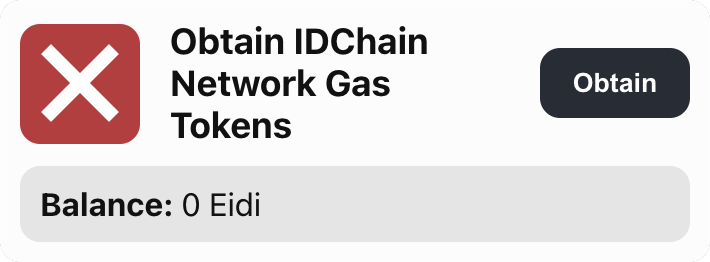
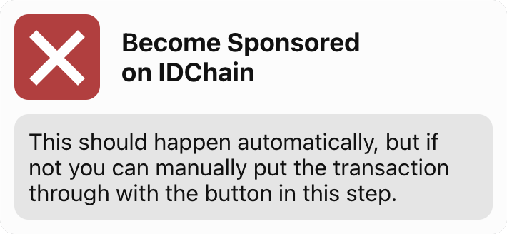
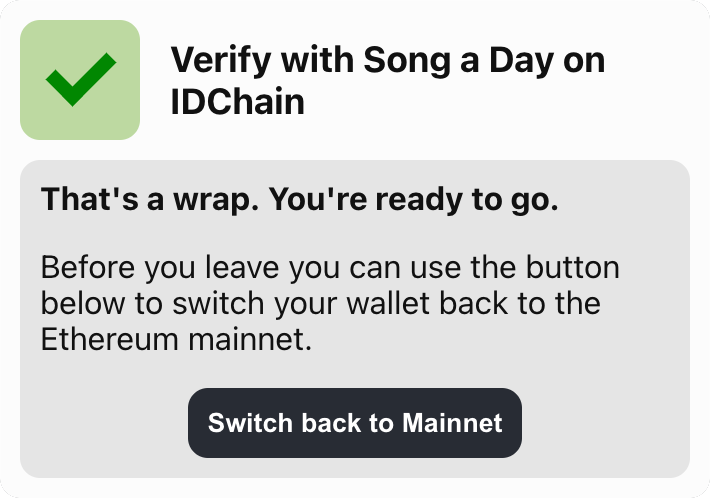

# Song a DAO - Snapshot Registration

## Reason for Registration

<section>
Song a DAO is different than most DAOs you are already familiar with.  Unlike what has become the traditional DAO format, where the voting power of an individual is tied to the number of tokens they have, Song a DAO is setup so that each person has one vote regardless of their total number of NFTs held.  This is because Song a DAO is a registered CO-OP in the state of Colorado.  The voting structure reflects the legal status of the organization.

This means is that we need a way to determine that no person can ever cast more than one vote. The biggest hurdle here is protecting the vote from people who buy multiple NFTs and hold each one in a separate wallet. To accomplish this we are using a service called <a href="https://www.brightid.org/" target="_blank">BrightID</a>, which provides a method for verifying a person is an actual person and combat the situation of one anon pretending to be multiple people.

</section>

---

## Registration App

<section>
There are a number of steps in the registration process. We've created a simple registration dapp for you to use to complete each step in the process.

It can be accessed at <a href="https://idchain.songadao.org/idchain-registration/" target="_blank">Song a Day Registration App</a>

The rest of this documentation explains what the steps you will be doing in the registration app are for.

</section>

---

## Step 1: Install & Verify with BrightID

The first step of this process is to install the BrightID mobile app and go through their registration process.

<!-- https://brightid.gitbook.io/brightid/getting-verified -->

---

## Step 2: Connect Wallet

For this step just connect to the site with the wallet that contains your Song A Day NFT.

---

## Step 3: Link Wallet with IDChain

In this step you will link your wallet to IDChain so that you can obtain some gas tokens you will need in a future step. Complete this step by scanning the QR code with the device that has BrightID installed on, or just click the "Link Address" button if you're already on that device.

---

## Step 4: Link Wallet with Snapshot

This step is almost exactly the same as the previous step, except in this one you are linking your wallet to Snapshot. Complete this step by scanning the QR code with the device that has BrightID installed on, or just click the "Link Address" button if you're already on that device.

---

## Step 5: Switch to IDChain network in your wallet.

In order to avoid any transactions costs for registering we use the IDChain network, which is an Ethereum side-chain created by the same people who created BrightID. To execute transactions on IDChain you will need to add it as a network to your wallet.

---

### Desktop

If you're on MetaMask desktop it's as simple as clicking a button in our registration dapp and confirming the addition of the IDChain network when prompted by MetaMask.

---

### Mobile

If you're on mobile the process requires some manual intervention. MetaMask is used in the following example. If you use an alternative wallet check the documentation for that wallet to see if they offer instructions for adding an additional network.

---

#### Open your MetaMask and click/tap on where it says "Ethereum Mainnet"

---

#### Click/tab on "Add Network"

---

#### Fill in Network Details

<section class="col-2">

You'll see something like the screenshot below (depending on if you’re on mobile or desktop.)

On this page, fill in the fields with the following information:

**Network Name:** IDChain

**RPC URL:** https://idchain.one/rpc/

**Chain ID:** 74

**Currency Symbol:** Eidi

**Block Explorer URL:** https://explorer.idchain.one

</section>

---

## Step 6: Obtain IDChain Network Gas Tokens

You will need some of the gas tokens for the IDChain network in order to run transactions in the next steps. To get some just click the "Obtain" button in this step and wait around 30 seconds. The registration dapp will update with your balance once the tokens have been transferred.

---

## Step 7: Become Sponsored on IDChain

As the message on this step says, it should happen automatically as part of the earlier verification steps. By the time you get here it has most likely already completed in the background while you were doing the other steps. If, however, you get to this step and it still shows as incomplete, you can click the “Go” button to process a sponsorship transaction yourself.

---

## Step 8: Verify with Song a Day on IDChain

This is the final step, and is what will register you to vote in the DAO. This step will execute a wallet transaction on the IDChain network. Click the "Verify" button to initiate it and then confirm the transaction like you would any other. You will be executing this on the IDChain blockchain with the tokens you obtained in the earlier step. Once the verification transaction confirms the registration dapp will update to reflect your completed verification status.

---

## Step 9: Verification Complete

And that’s it. You’re registered and can now vote on DAO proposals. Before you leave you will want to switch your wallet back to the Ethereum mainnet. If you’re on desktop, you can just click the “Switch back to Mainnet” button. If you’re on mobile, just use the same method you used to switch to IDChain, but select "Ethereum Mainnet" in the list of networks.

