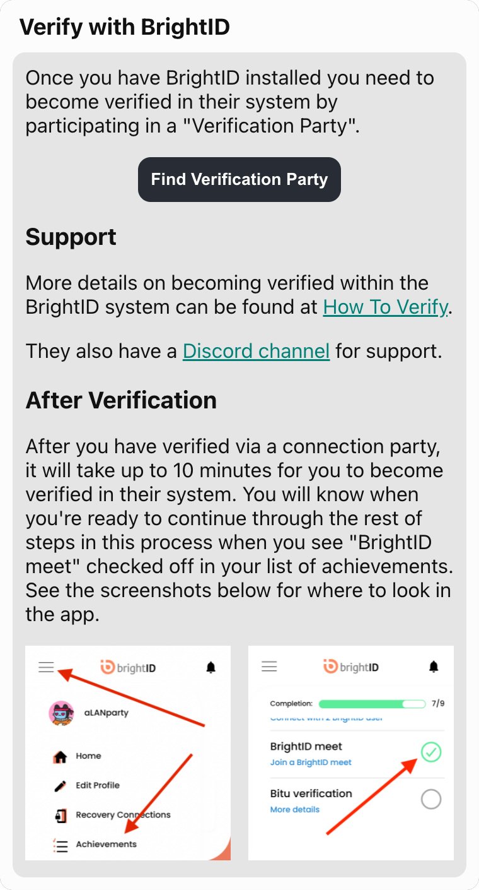
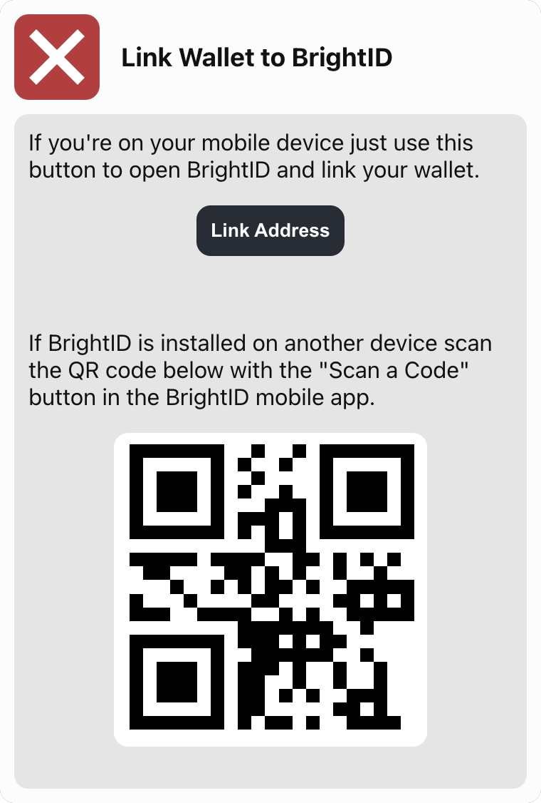
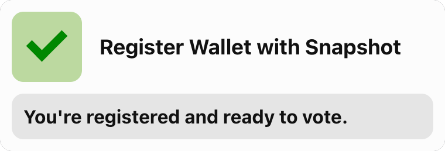

# Song a DAO - Snapshot Registration

## Reason for Registration

<section>
Song a DAO is different than most DAOs you are already familiar with.  Unlike what has become the traditional DAO format, where the voting power of an individual is tied to the number of tokens they have, Song a DAO is setup so that each person has one vote regardless of their total number of NFTs held.  This is because Song a DAO is a registered CO-OP in the state of Colorado.  The voting structure reflects the legal status of the organization.

This means is that we need a way to determine that no person can ever cast more than one vote. The biggest hurdle here is protecting the vote from people who buy multiple NFTs and hold each one in a separate wallet. To accomplish this we are using a service called <a href="https://www.brightid.org/" target="_blank">BrightID</a>, which provides a method for verifying a person is an actual person and combat the situation of one anon pretending to be multiple people.

</section>

---

## Registration App

<section>
There are a number of steps in the registration process. We've created a simple registration dapp for you to use to complete each step in the process.

It can be accessed at <a href="https://idchain.songadao.org/brightid-registration/" target="_blank">Song a Day Registration App</a>

The rest of this documentation explains what the steps you will be doing in the registration app are for.

</section>

---

## Step 1: Install & Verify with BrightID

The first step of this process is to install the BrightID mobile app and go through their registration process.

<!-- https://brightid.gitbook.io/brightid/getting-verified -->

---

## Step 2: Connect Wallet

For this step just connect to the site with the wallet that contains your Song A Day NFT.

---

## Step 3: Link Wallet with Snapshot

In this step you are linking your wallet to Snapshot. Complete this step by scanning the QR code with the device that has BrightID installed on, or just click the "Link Address" button if you're already on that device.

---

## Step 4: Register Wallet with Snapshot

This is the final step, and is what will register you to vote in the DAO. Click the button to register. Once the verification completes the registration dapp will update to reflect your completed verification status.

---

## Verification Complete

And that’s it. You’re registered and can now vote on DAO proposals.

